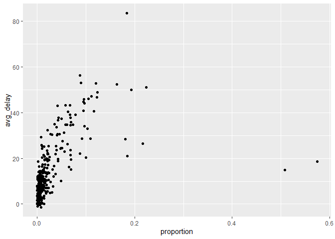

Homework 2
================
Graham Miotke
9/27/2021

``` r
flights
```

    ## # A tibble: 336,776 x 19
    ##     year month   day dep_time sched_dep_time dep_delay arr_time sched_arr_time
    ##    <int> <int> <int>    <int>          <int>     <dbl>    <int>          <int>
    ##  1  2013     1     1      517            515         2      830            819
    ##  2  2013     1     1      533            529         4      850            830
    ##  3  2013     1     1      542            540         2      923            850
    ##  4  2013     1     1      544            545        -1     1004           1022
    ##  5  2013     1     1      554            600        -6      812            837
    ##  6  2013     1     1      554            558        -4      740            728
    ##  7  2013     1     1      555            600        -5      913            854
    ##  8  2013     1     1      557            600        -3      709            723
    ##  9  2013     1     1      557            600        -3      838            846
    ## 10  2013     1     1      558            600        -2      753            745
    ## # ... with 336,766 more rows, and 11 more variables: arr_delay <dbl>,
    ## #   carrier <chr>, flight <int>, tailnum <chr>, origin <chr>, dest <chr>,
    ## #   air_time <dbl>, distance <dbl>, hour <dbl>, minute <dbl>, time_hour <dttm>

Question 1!

``` r
flights%>%
  filter(is.na(dep_time))
```

    ## # A tibble: 8,255 x 19
    ##     year month   day dep_time sched_dep_time dep_delay arr_time sched_arr_time
    ##    <int> <int> <int>    <int>          <int>     <dbl>    <int>          <int>
    ##  1  2013     1     1       NA           1630        NA       NA           1815
    ##  2  2013     1     1       NA           1935        NA       NA           2240
    ##  3  2013     1     1       NA           1500        NA       NA           1825
    ##  4  2013     1     1       NA            600        NA       NA            901
    ##  5  2013     1     2       NA           1540        NA       NA           1747
    ##  6  2013     1     2       NA           1620        NA       NA           1746
    ##  7  2013     1     2       NA           1355        NA       NA           1459
    ##  8  2013     1     2       NA           1420        NA       NA           1644
    ##  9  2013     1     2       NA           1321        NA       NA           1536
    ## 10  2013     1     2       NA           1545        NA       NA           1910
    ## # ... with 8,245 more rows, and 11 more variables: arr_delay <dbl>,
    ## #   carrier <chr>, flight <int>, tailnum <chr>, origin <chr>, dest <chr>,
    ## #   air_time <dbl>, distance <dbl>, hour <dbl>, minute <dbl>, time_hour <dttm>

8,255 flights have a missing departure time. The other missing variables
from these flights are departure delay, arrival time, arrival delay &
air time. These observations most likely represent cancelled flights.

Question 2!

``` r
flights%>%
  mutate(dep_time = (dep_time%/%100)*60 + dep_time%%100,
         sched_dep_time = (sched_dep_time%/%100)*60 + sched_dep_time%%100,
         arr_time = (arr_time%/%100)*60 + arr_time%%100,
         sched_arr_time = (sched_arr_time%/%100)*60 + sched_arr_time%%100)
```

    ## # A tibble: 336,776 x 19
    ##     year month   day dep_time sched_dep_time dep_delay arr_time sched_arr_time
    ##    <int> <int> <int>    <dbl>          <dbl>     <dbl>    <dbl>          <dbl>
    ##  1  2013     1     1      317            315         2      510            499
    ##  2  2013     1     1      333            329         4      530            510
    ##  3  2013     1     1      342            340         2      563            530
    ##  4  2013     1     1      344            345        -1      604            622
    ##  5  2013     1     1      354            360        -6      492            517
    ##  6  2013     1     1      354            358        -4      460            448
    ##  7  2013     1     1      355            360        -5      553            534
    ##  8  2013     1     1      357            360        -3      429            443
    ##  9  2013     1     1      357            360        -3      518            526
    ## 10  2013     1     1      358            360        -2      473            465
    ## # ... with 336,766 more rows, and 11 more variables: arr_delay <dbl>,
    ## #   carrier <chr>, flight <int>, tailnum <chr>, origin <chr>, dest <chr>,
    ## #   air_time <dbl>, distance <dbl>, hour <dbl>, minute <dbl>, time_hour <dttm>

Question 3!

``` r
flights%>%
  group_by(month,day)%>%
  mutate(cancelled = is.na(dep_time))%>%
  summarize(avg_delay = mean(dep_delay, na.rm = T),
            number_flights = n(),
            number_cancelled = sum(cancelled),
            proportion = number_cancelled/number_flights)%>%
  ggplot(aes(x=proportion, y = avg_delay))+geom_point()
```

    ## `summarise()` regrouping output by 'month' (override with `.groups` argument)

<!-- -->

It does not seem as if there is a pattern in the number of cancelled
flights. Based on the graph, it also seems as if there is not a
significant relation between the average delay and the proportion of
flights cancelled on that day.
